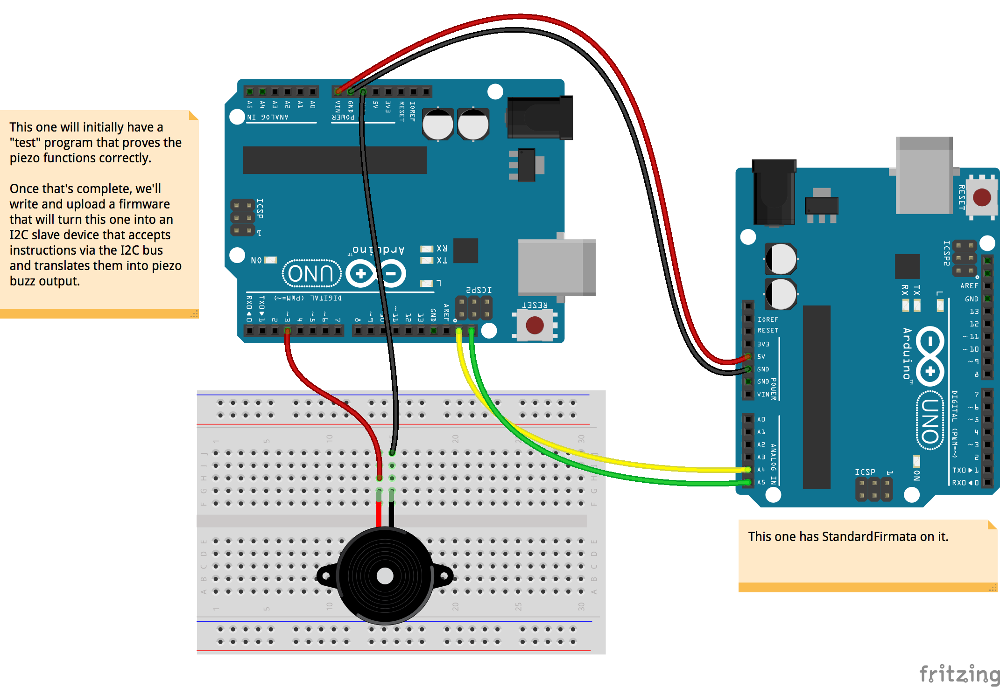

1. Setup Hardware
  
2. Try an Arduino sketch
  ```ino
  /*
    Arduino Mario Bros Tunes
    With Piezo Buzzer and PWM

    Connect the positive side of the Buzzer to pin 3,
    then the negative side to a 1k ohm resistor. Connect
    the other side of the 1 k ohm resistor to
    ground(GND) pin on the Arduino.

    by: Dipto Pratyaksa
    last updated: 31/3/13
  */

  /*************************************************
   * Public Constants
   *************************************************/

  #define NOTE_B0  31
  #define NOTE_C1  33
  #define NOTE_CS1 35
  #define NOTE_D1  37
  #define NOTE_DS1 39
  #define NOTE_E1  41
  #define NOTE_F1  44
  #define NOTE_FS1 46
  #define NOTE_G1  49
  #define NOTE_GS1 52
  #define NOTE_A1  55
  #define NOTE_AS1 58
  #define NOTE_B1  62
  #define NOTE_C2  65
  #define NOTE_CS2 69
  #define NOTE_D2  73
  #define NOTE_DS2 78
  #define NOTE_E2  82
  #define NOTE_F2  87
  #define NOTE_FS2 93
  #define NOTE_G2  98
  #define NOTE_GS2 104
  #define NOTE_A2  110
  #define NOTE_AS2 117
  #define NOTE_B2  123
  #define NOTE_C3  131
  #define NOTE_CS3 139
  #define NOTE_D3  147
  #define NOTE_DS3 156
  #define NOTE_E3  165
  #define NOTE_F3  175
  #define NOTE_FS3 185
  #define NOTE_G3  196
  #define NOTE_GS3 208
  #define NOTE_A3  220
  #define NOTE_AS3 233
  #define NOTE_B3  247
  #define NOTE_C4  262
  #define NOTE_CS4 277
  #define NOTE_D4  294
  #define NOTE_DS4 311
  #define NOTE_E4  330
  #define NOTE_F4  349
  #define NOTE_FS4 370
  #define NOTE_G4  392
  #define NOTE_GS4 415
  #define NOTE_A4  440
  #define NOTE_AS4 466
  #define NOTE_B4  494
  #define NOTE_C5  523
  #define NOTE_CS5 554
  #define NOTE_D5  587
  #define NOTE_DS5 622
  #define NOTE_E5  659
  #define NOTE_F5  698
  #define NOTE_FS5 740
  #define NOTE_G5  784
  #define NOTE_GS5 831
  #define NOTE_A5  880
  #define NOTE_AS5 932
  #define NOTE_B5  988
  #define NOTE_C6  1047
  #define NOTE_CS6 1109
  #define NOTE_D6  1175
  #define NOTE_DS6 1245
  #define NOTE_E6  1319
  #define NOTE_F6  1397
  #define NOTE_FS6 1480
  #define NOTE_G6  1568
  #define NOTE_GS6 1661
  #define NOTE_A6  1760
  #define NOTE_AS6 1865
  #define NOTE_B6  1976
  #define NOTE_C7  2093
  #define NOTE_CS7 2217
  #define NOTE_D7  2349
  #define NOTE_DS7 2489
  #define NOTE_E7  2637
  #define NOTE_F7  2794
  #define NOTE_FS7 2960
  #define NOTE_G7  3136
  #define NOTE_GS7 3322
  #define NOTE_A7  3520
  #define NOTE_AS7 3729
  #define NOTE_B7  3951
  #define NOTE_C8  4186
  #define NOTE_CS8 4435
  #define NOTE_D8  4699
  #define NOTE_DS8 4978

  #define PIN 3

  // Mario Melody
  int melody[] = {
    NOTE_E7, NOTE_E7, 0, NOTE_E7,
    0, NOTE_C7, NOTE_E7, 0,
    NOTE_G7, 0, 0,  0,
    NOTE_G6, 0, 0, 0,

    NOTE_C7, 0, 0, NOTE_G6,
    0, 0, NOTE_E6, 0,
    0, NOTE_A6, 0, NOTE_B6,
    0, NOTE_AS6, NOTE_A6, 0,

    NOTE_G6, NOTE_E7, NOTE_G7,
    NOTE_A7, 0, NOTE_F7, NOTE_G7,
    0, NOTE_E7, 0, NOTE_C7,
    NOTE_D7, NOTE_B6, 0, 0,

    NOTE_C7, 0, 0, NOTE_G6,
    0, 0, NOTE_E6, 0,
    0, NOTE_A6, 0, NOTE_B6,
    0, NOTE_AS6, NOTE_A6, 0,

    NOTE_G6, NOTE_E7, NOTE_G7,
    NOTE_A7, 0, NOTE_F7, NOTE_G7,
    0, NOTE_E7, 0, NOTE_C7,
    NOTE_D7, NOTE_B6, 0, 0
  };

  // Mario Tempo
  int tempo[] = {
    12, 12, 12, 12,
    12, 12, 12, 12,
    12, 12, 12, 12,
    12, 12, 12, 12,

    12, 12, 12, 12,
    12, 12, 12, 12,
    12, 12, 12, 12,
    12, 12, 12, 12,

    9, 9, 9,
    12, 12, 12, 12,
    12, 12, 12, 12,
    12, 12, 12, 12,

    12, 12, 12, 12,
    12, 12, 12, 12,
    12, 12, 12, 12,
    12, 12, 12, 12,

    9, 9, 9,
    12, 12, 12, 12,
    12, 12, 12, 12,
    12, 12, 12, 12,
  };

  void setup(void) {
    pinMode(3, OUTPUT);
  }

  void loop() {
    mario();
  }
  int song = 0;

  void mario() {
    // sizeof(int) = 2
    int size = sizeof(melody) / sizeof(int);
    for (int note = 0; note < size; note++) {
      //e.g. quarter note = 1000 / 4, eighth note = 1000/8, etc.
      int duration = 1000 / tempo[note];

      buzz(PIN, melody[note], duration);

      // to distinguish the notes, set a minimum time between them.
      // the note's duration + 30% seems to work well:
      int pauseBetweenNotes = duration * 1.30;
      delay(pauseBetweenNotes);

      // stop the tone playing:
      buzz(PIN, 0, duration);
    }
  }

  void buzz(int targetPin, long frequency, long duration) {
    // Delay value between transitions:
    // 1s = 1000000us
    // 1s / frequency / 2 (two phases of each cycle)
    long phaseDelay = 1000000 / frequency / 2; 
    // calculate the number of cycles
    long cycles = frequency * duration / 1000; 
    
    for (int i = 0; i < cycles; i++) {
      digitalWrite(targetPin, HIGH);
      delayMicroseconds(phaseDelay);
      digitalWrite(targetPin, LOW);
      delayMicroseconds(phaseDelay);
    }
  }
  ```
3. Explain Why I2C
4. Walk through data 
  ```
  Piezo Data {
    Pin,
    Frequency,
    Duration,
  }

  
  Pin       B[7:0]
  
  Frequency B[15:8]
  Frequency B[7:0]
  
  Duration  B[31:24]
  Duration  B[23:16]
  Duration  B[15:8]
  Duration  B[7:0]

  ```

4. Walk through creating the firmware
  - Receive events, read available bytes
  - Process data: 
    + `Pin` is one byte
    + `Frequency` is two bytes, OR them into a single uint16_t
    + `Duration` is four bytes, OR them into a single uint32_t
    ```ino
    uint8_t command = data[0] & 0xFF;
    uint8_t pin = data[1] & 0xFF;
    uint16_t hz = (data[2] << 8) | data[3];
    uint32_t us = (data[4] << 24) | (data[5] << 16) | (data[6] << 8) | data[7];
    ```
  - With processed data, carry out instructions
    + command: TONE
    ```
    tone(Pin, Frequency, Duration);
    delayMicroseconds(Duration);
    ```
    + command: NO_TONE
    ```
    tone(Pin, Frequency, Duration);
    delayMicroseconds(Duration);
    ```

5. Walk through creating the controller
  - Implement tone
  ```
  [
    TONE, // 0xFF
    pin, // will never be > 127
    (tone >> 8) & 0xff, 
    tone & 0xff,
    (duration >> 24) & 0xff, 
    (duration >> 16) & 0xff, 
    (duration >> 8) & 0xff, 
    duration & 0xff,
  ]    
  ```
  - Implement noTone
  ```
  [
    NO_TONE, // 0xFE
    pin, 
    (tone >> 8) & 0xff, 
    tone & 0xff,
    (duration >> 24) & 0xff, 
    (duration >> 16) & 0xff, 
    (duration >> 8) & 0xff, 
    duration & 0xff,
  ]    
  ```

6. Walk through writing tests


